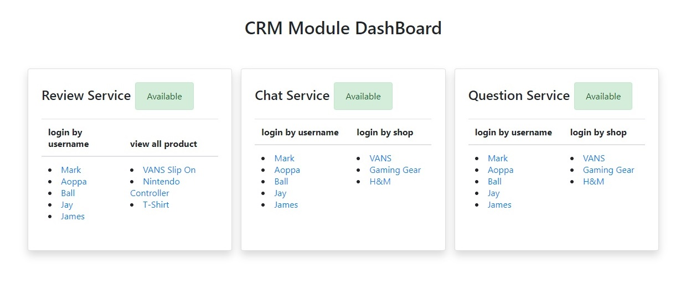
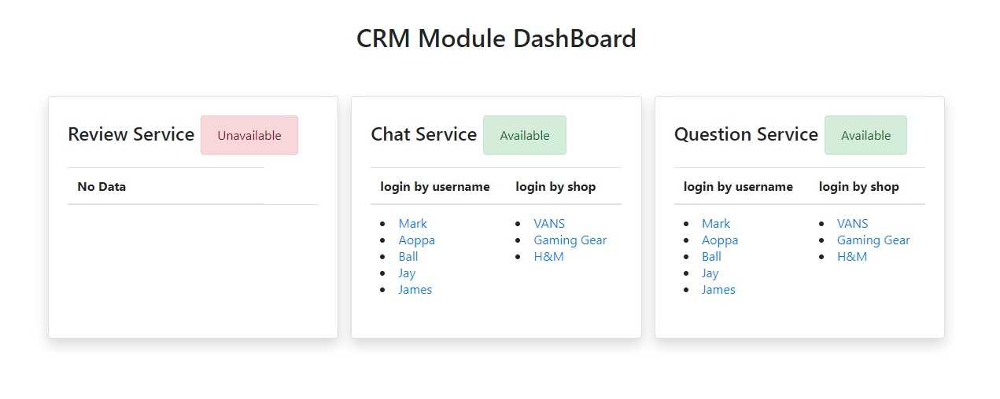
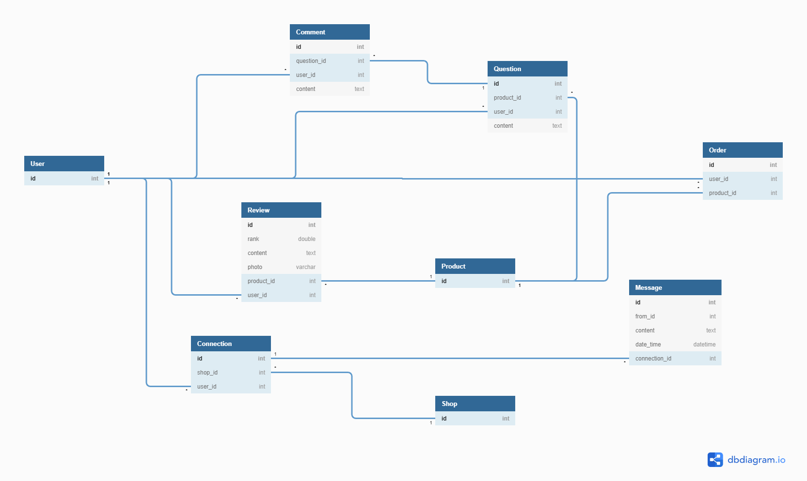

# CRM Module

โปรเจคนี้เป็นส่วนหนึ่งของรายวิชา Service-Oriented Programming เป็นการพัฒนาระบบย่อยของ E-Commerce ซึ่งก็คือระบบ CRM Module จะใช้โปรเจค React ในการพัฒนาระบบ CRM Module เป็นส่วนที่จัดการเกี่ยวกับการรักษาความสัมพันธ์กับลูกค้า (เพื่อให้การติดต่อกันระหว่างร้านค้ากับลูกค้าได้สะดวกมากยิ่งขึ้น) โดยจะมี Service ย่อยๆ ดังนี้

<ul>
    <li>การรีวิวสินค้า (Review Service)</li>
    <li>การให้ลูกค้าหรือ user สอบถามเกี่ยวกับสินค้านั้นๆ (Question Service)</li>
    <li>message ติดต่อกันระหว่างลูกค้ากับร้านค้านั้นๆ (Chat Service)</li>
</ul>

<h5>How to run this project.</h5>
<ol>
    <li>run project back-end => <a href="https://github.com/looksocii/SOP_API">Code</a></li>
    <ul>
        <li>npm install</li>
        <li>npm run serve</li>
    </ul>
    <li>run project front-end => <a href="https://github.com/looksocii/E-Commerce_CRM-Module">Code</a></li>
    <ul>
        <li>npm install</li>
        <li>npm run serve</li>
    </ul>
</ol>

# Cloud Functions for Firebase (Back-End)

ในการสร้าง API เพื่อให้ฝั่ง Front-End ดึง API ไปใช้งาน ก็จะใช้ Cloud Functions for Firebase หรือเป็นโปรเจค Node JS ที่สนับสนุนการจัดการข้อมูลใน Firebase โดยตรง

<ul>
    <li><a href="https://github.com/looksocii/SOP_API">Code (Cloud Functions for Firebase)</a></li>
</ul>

## Swagger CRM Module API

<li>Read : https://app.swaggerhub.com/apis/SirapopJayz/CRM_API/1.0.0</li>

## CRM Database (Logical Design)

<h5>Module อื่นๆที่เกี่ยวข้อง</h5>
    <ul>
        <li>User</li>
        <li>Shop</li>
        <li>Order</li>
        <li>Product</li>
    </ul>

## Manage Tasks

<ol>
    <li>นายพันธกานต์ แก้วสังหาร (61070139 - Head)</li>
    <ul>
        <li>คิดคอนเซ็ปและออกแบบโฟลการทํางานโดยรวมของระบบ CRM และฟีเจอร์ต่างๆ</li>
        <li>จัดการเกี่ยวกับการพัฒนาและออกแบบหน้า DashBoard ที่แสดงสถานะของ Service ต่างๆ บนโปรเจค React</li>
        <li>จัดการเกี่ยวกับการดึงข้อมูลและระบบฟีเจอร์ต่างๆภายใน Web App</li>
    </ul>
    <li>นายพันธวีร์ คงสวัสดิ์ (61070140)</li>
    <ul>
        <li>ออกแบบ UI prototyping</li>
        <li>จัดการเกี่ยวกับหน้า Frontend</li>
    </ul>
    <li>นายนนททรัพย์ เซี่ยงฉิน (61070095)</li>
     <ul>
         <li>จัดการเกี่ยวกับหน้า Frontend</li>
         <li>จัดการ Frontend ลง React และแก้ไขในหน้าบางหน้า</li>       
     </ul>
    <li>นายพัชรพล บุญชุ่ม (61070136)</li>
    <ul>
        <li>จัดการเกี่ยวกับการสร้าง API</li>
        <li>จัดการเกี่ยวกับ Database</li>
        <li>จัดการเกี่ยวกับการดึงข้อมูลและฟีเจอร์ต่างๆ บางส่วน</li>
    </ul>
    <li>นายสิรภพ รักเกื้อ (61070241)</li>
    <ul>
        <li>ทำ swagger crm service​ api</li>
        <li>จัดการเกี่ยวกับหน้า Frontend ลง​ React</li>
        <li>ช่วยจัดการเกี่ยวกับ​ Database​ บางส่วน</li>
    </ul>
</ol>
